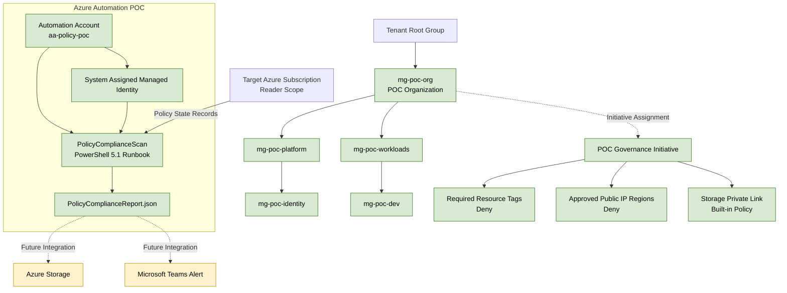

# Azure Enterprise Governance POC Architecture

```mermaid
flowchart TB
    ROOT["Tenant Root Group"]
    ORG["mg-poc-org<br/>POC Organization"]

    ROOT --> ORG

    ORG --> PLATFORM["mg-poc-platform"]
    ORG --> WORKLOADS["mg-poc-workloads"]

    PLATFORM --> IDENTITY["mg-poc-identity"]
    WORKLOADS --> DEV["mg-poc-dev"]

    ORG -. "Initiative Assignment" .-> POLICY["POC Governance Initiative"]

    POLICY --> TAG["Required Resource Tags<br/>Deny"]
    POLICY --> PUBLICIP["Approved Public IP Regions<br/>Deny"]
    POLICY --> STORAGE["Storage Private Link<br/>Built-in Policy"]

    subgraph AUTOMATION["Azure Automation POC"]
        AA["Automation Account<br/>aa-policy-poc"]
        MI["System Assigned Managed Identity"]
        RB["PolicyComplianceScan<br/>PowerShell 5.1 Runbook"]
        JSON["PolicyComplianceReport.json"]
        
        AA --> MI
        AA --> RB
        MI --> RB
        RB --> JSON
    end

    TARGET["Target Azure Subscription<br/>Reader Scope"]
    TARGET -->|"Policy State Records"| RB

    JSON -. "Future Integration" .-> STORAGEOUT["Azure Storage"]
    JSON -. "Future Integration" .-> TEAMS["Microsoft Teams Alert"]

    classDef completed fill:#d9ead3,stroke:#38761d,color:#000
    classDef pending fill:#fff2cc,stroke:#bf9000,color:#000

    class ORG,PLATFORM,WORKLOADS,IDENTITY,DEV,POLICY,TAG,PUBLICIP,STORAGE,AA,MI,RB,JSON completed
    class STORAGEOUT,TEAMS pending
```
